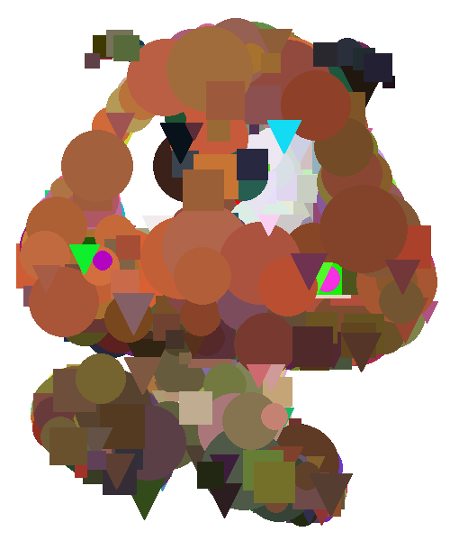

## Genetic Algorithm Fun

This repository contains the programs that I made which use genetic algorithms.

# Wordle
- This is a simple program, it solves a wordle (or any word of any length) using a simple genetic algorithm.
- The fitness is determined by how many of the correct letters are present and how many letters are in the correct spot.
- The mutation chooses between either swapping two letters or changing one letter.

# Sodoku
- There are two sodoku files, one is the genetic algorithm one, and the other uses backtracking.
- I decided to do both methods to test and see which would be faster, and the backtracking method was able to solve sodokus much faster.
- The fitness is determined by how many duplicates there are in each row, col, and square.
- The mutation is a swap mutation since all chromosomes in the inital population contain the necessary amount of numbers.

# Image Generation
- This was by far the most fun program to make as it possed the most unique implementation of a genetic algorithm.
- The purpose of this program is to generate an image only using triangles, rectangles, and circles, so that it closely matches the target image.
- The fitness is determined by the difference between the image's RGB values.
- The mutation randomly changes a shape.
- Below is the result of 1000 generations.

